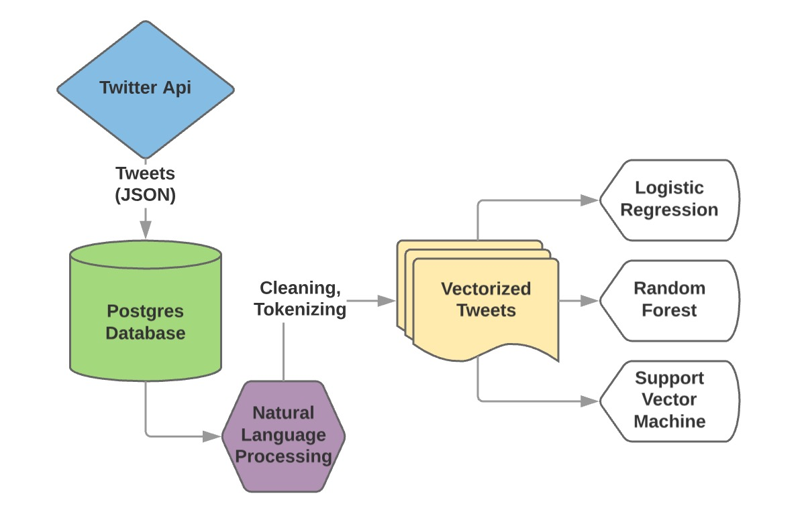
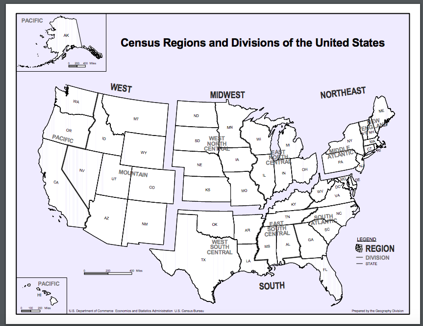
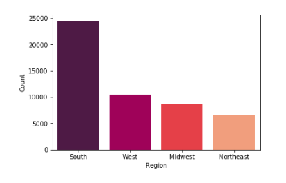
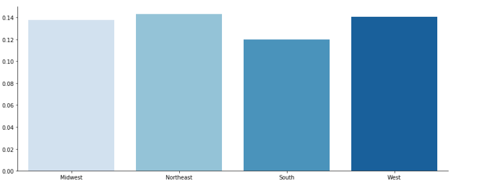
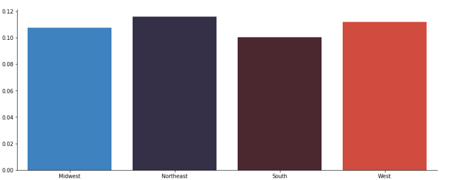
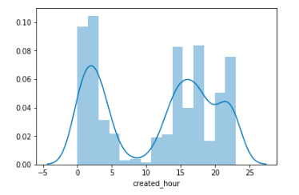
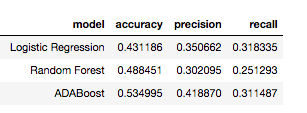

# Identifying Tweet Geographic Location

## Project Motivation
Twitter offers particularly useful data because all tweets are happening in real-time. This affords us the opportunity to understand things such as localized disease outbreaks or user engagement on current events. However, in order to conduct such projects, it is important to be able to identify the geographic location of relevant tweets. While Twitter allows users to geotag their tweets, only about 1% of tweets are actually geotagged. This limits the amount of useful information available. This project is intended to potentially identify the geographic location of tweets, using various machine learning models, in order to overcome this significant limitation. 

## Process Overview

## Data Sources
### Database
A PostgreSQL database was built, using SQLAlchemy to construct the schema.

### Twitter
Tweepy was used to access the Twitter API. Live-streamed tweets, only restricted to those that were geotagged and located within the continental U.S., Hawaii, or Alaska, were stored in a PostgreSQL database. Over 3 days, approximately 50,000 tweets were stored for subsequent analysis.

## Tweet Characteristics
The following features were used in analyses including:

* Tweet text
* Tweet geolocation
* Tweet sentiment score
* Tweet creation time (UTC) 
* User location 

## Defining Geographic Location
Due to the limited number of tweets, geographic location was defined broadly as:

1. Northeast
2. South
3. Midwest
4. West

A given tweet was mapped to the nearest major city based on its associated longitude and latitude. Regional location was defined based on the tweet's assigned city.

## Defining Sentiment
Measures of sentiment were added to the dataset in order to assess whether sentiment varies by region. Two measures, VADER and TextBlob, were included as a means of comparison.

### VADER
Valence Aware Dictionary and sEntiment Reasoner or VADER is a Python package intended for sentiment analysis of social media text. Each word is rated based on how positive or negative it is. VADER produces 4 metrics:

* Positive: Proportion of words rated as positive in the tweet
* Negative: Proportion of words rated as negative in the tweet
* Neutral: Proportion of words rated as neutral in the tweet
* Compound: A standardized (-1 to 1) score which assesses the overall sentiment of the tweet; the more positive the score, the more positive the tweet

For the purposes of this project, the compound score was used as a sentiment measure. 

### TextBlob
TextBlob is a Python library also intended for sentiment analysis and produces polarity and subjectivity scores. For the purposes of this project, the polarity score was used as a sentiment measure. 

## Visualizations
All visualizations were presented on Jupyter notebook.

## Class Imbalance
Due to the sheer size of the south, there was an evident class imbalance. 

SMOTE and random oversampling were used to address this class imbalance issue. 

### SMOTE
Synthetic Minority Oversampling Technique or SMOTE oversamples the minority class. However it creates synthetic points by averaging the k-nearest neighbors in vector space and scaling by a random coefficient. This was very useful at first, however as our dataset became very large and the dimensionality of our vectors grew, it became much less effective.

### Random Oversampling
Random oversampling relies on sampling with replacement from the minority classes, to achieve a better ratio. This was useful throughout the project, but the main drawbacks are that it leads to overfitting of the minority class and higher variance.

## Regional Variations

### By Sentiment
**VADER Score Regional Variations**

**TextBlob Score Regional Variations**

No meaningful variations by sentiment score, using VADER or TextBlob, were found. 

### By Time Created
Tweet creation time was also available for all tweets, standardized to UTC time. As such, variations in tweet creation time by region (since the time zone is the same across all tweets and peak hours must differ across regions using this measure).

Unfortunately, no differences were found using this measure. One of the limitations was that as live tweets were being collected, they were limited by personal commute times. Tweets could only be collected when our laptops were open and had access to internet. When we were commuting, tweets were not being collected, resulting in any observed fluctuations in activity. 

## Natural Language Processing: Feature Extraction
In order to be used in machine learning algorithms, text must be converted into vectors of numbers. Such vectors are intended to represent characteristics of the texts.

### Bag-of-Words (BoW)
A BoW is a simplistic representation of a document; the occurrence of each word is measured and used as a feature. It is called a *bag* of words because the arrangement of the words, or any other details, are not considered. Documents are simply characterized by the presence of known words.

**Count Vectorization**

The (count) frequency of each known word in a given document is measured.

**TF-IDF Vectorization**

The frequency of each known word is offset by its overall frequency in the corpus (the collection of documents).

### NLP Model Selection
TF-IDF vectorization was used for this project, using validation accuracy as a metric. 

## Machine Learning: Tweet Identification
The following machine learning classification algorithms were used:
* Logistic Regression
* Random Forest
* Adaboost

For cross-validation, the tweet dataset was split into training and validation sets.

For each classifier, a grid-search was run to determine the best hyperparameters for the given classifier. Classifiers were then fit on the training data and assessed using the following metrics:

* Validation accuracy

### Cross-Validation: Validation Accuracy
A given classification model was fit on the training data. It then classified the validation data. To assess the accuracy of the model, those predictions were compared to the actual labels.

### Machine Learning Model Selection
AdaBoost was found to be the best classifier for the data, with a validation accuracy of ~53%. 

## Conclusions
* AdaBoost performed better than chance alone, with a validation accuracy of 53%. However, there were some limitations in the project that could be improved upon.

### Limitations
* Due to time constraints, only live-streamed tweets could be collected to generate enough data for subsequent analyses. The standard Twitter API only allows for very limited historical searches (up to a week), returning only a small sample of relevant tweets. With more time, more tweets could be collected so that cities could be used as labels, rather than just regions. 
* The accuracy was limited when other geolocation information (i.e. user location) was not available.
* Tweet collection was limited to when we had internet access and were able to run queries. 
* High model training time

### Next Steps 
* Collect more tweets 
* Run gridsearches
* Run analyses with topic-specific tweets, which might provide more insight into geographic variations in user sentiment
